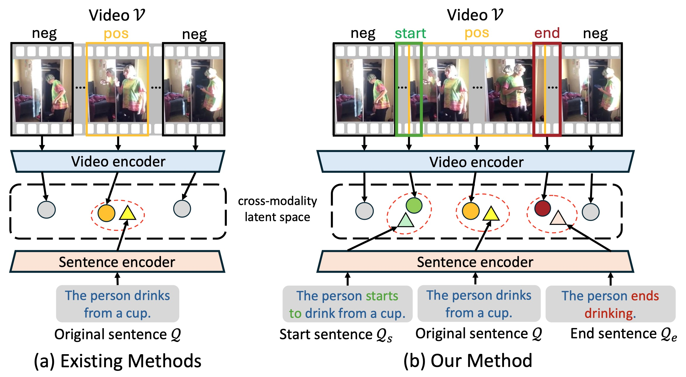

    I'm a PhD student at the University of Tokyo, supervised by Prof. <a href="https://sites.google.com/ut-vision.org/ysato/">Yoichi Sato</a>. I focus on computer vision and human activity understanding, specifically involving video and multi-view understanding, vision-language multimodal models, and human body perception.

Education

    

        
    

    

        
The University of Tokyo

        

            Ph.D. in Information Science
            2026.3
        

        

            M.Sc. in Information Science
            2023.3
        

    

    

        
    

    

        
Nanjing University

        

            B.Sc. in Computer Science
            2020.7
        

    

Research Experience

    

        

            
            

                

                    Intern at CyberAgent AI Lab
                    Activity Understanding Team
                

            

        

        2024
    

    

        

            
            

                

                    Intern at Shanghai AI Laboratory
                    OpenGVLab
                

            

        

        2023
    

    

        

            
            

                

                    Intern at Microsoft Research Asia
                    Media Computing Group
                

            

        

        2022
    

Services and Awards

    

        •
        Reviewer of CVPR, ICCV, ECCV, NeurIPS, ICML, ICLR, AAAI, ACMMM, BMVC
    

    

        •
        JSPS Research Fellowship for Young Scientists DC2
        2025
    

    

        •
        UTokyo-IIS Research Collaboration Initiative Award
        2024
    

    

        •
        "Stars of Tomorrow" award by Microsoft Research Asia
        2023
    

    

        •
        Contracted photographer of Visual China Group
    

Publications

[a] video and multi-view understanding  
[b] vision-language multimodal models  
[c] human body perception  

    
Arxiv

    

        #[b3]
    

    

        
    

    

        <h3 class="publication-title">An Egocentric Vision-Language Model based Portable Real-time Smart Assistant</h3>
        
Yifei Huang, Jilan Xu, Baoqi Pei, Yuping He, Guo Chen, <b>Mingfang Zhang</b>, Lijin Yang, ..., Limin Wang

        
Arxiv preprint, 2025

        

            <a href="https://github.com/OpenGVLab/vinci">Project Page</a>
            <a href="https://arxiv.org/pdf/2503.04250">Paper</a>
        

    

    
Arxiv

    

        #[b2]
    

    

        
    

    

        <h3 class="publication-title">Egocentric Action-aware Inertial Localization in Point Clouds</h3>
        
<b>Mingfang Zhang</b>, Ryo Yonetani, Yifei Huang, Liangyang Ouyang, Ruicong Liu, Yoichi Sato

        
Arxiv preprint, 2025

        

            <a href="/publication/2025-05-01-egocentric-localization">Project Page</a>
            <a href="https://arxiv.org/abs/2505.14346">Paper</a>
        

    

    
TCSVT

    

        #[b1]
    

    

        
    

    

        <h3 class="publication-title">Prompt-augmented Boundary Attentive Learning for Weakly Supervised Temporal Sentence Grounding</h3>
        
Zhehao Zhu, Yifei Huang, <b>Mingfang Zhang</b>, Liangyang Ouyang, Yoichi Sato

        
IEEE Transactions on Circuits and Systems for Video Technology (TCSVT), 2025

        

            <!-- <a href="/publication/2025-05-01-prompt-grounding">Project Page</a> -->
            <a href="https://ieeexplore.ieee.org/document/11015819">Paper</a>
        

    

    
ICLR

    

        #[c3]
    

    

        
    

    

        <h3 class="publication-title">SiMHand: Mining Similar Hands for Large-Scale 3D Hand Pose Pre-training</h3>
        
Nie Lin, Takehiko Ohkawa, Yifei Huang, <b>Mingfang Zhang</b>, Minjie Cai, Ming Li, Ryosuke Furuta, Yoichi Sato

        
International Conference on Learning Representations (ICLR), 2025

        

            <a href="https://tkhkaeio.github.io/projects/25-simhand/index.html">Project Page</a>
            <a href="https://arxiv.org/pdf/2502.15251">Paper</a>
        

    

    
ECCV

    

        #[a5]
    

    

        
    

    

        <h3 class="publication-title">Masked Video and Body-worn IMU Autoencoder for Egocentric Action Recognition</h3>
        
<b>Mingfang Zhang</b>, Yifei Huang, Ruicong Liu, Yoichi Sato

        
European Conference on Computer Vision (ECCV), 2024

        

            <a href="/publication/2024-07-01-masked-recognition">Project Page</a>
            <a href="http://www.arxiv.org/pdf/2407.06628">Paper</a>
        

    

    
CVPR

    

        #[a4]
    

    

        
    

    

        <h3 class="publication-title">EgoExoLearn: A Dataset for Bridging Asynchronous Ego- and Exo-centric View of Procedural Activities in Real World</h3>
        
(* co-first author) Yifei Huang* , Guo Chen*, Jilan Xu*, <b>Mingfang Zhang</b>*, Lijin Yang, Baoqi Pei, Hongjie Zhang, Lu Dong, Yali Wang, Limin Wang, Yu Qiao

        
IEEE Conference on Computer Vision and Pattern Recognition (CVPR), 2024

        

            <a href="https://github.com/OpenGVLab/EgoExoLearn">Project Page</a>
            <a href="https://arxiv.org/pdf/2403.16182.pdf">Paper</a>
        

    

    
CVPR

    

        #[c2]
    

    

        
    

    

        <h3 class="publication-title">Single-to-Dual-View Adaptation for Egocentric 3D Hand Pose Estimation</h3>
        
Ruicong Liu, Takehiko Ohkawa, <b>Mingfang Zhang</b>, Yoichi Sato

        
IEEE Conference on Computer Vision and Pattern Recognition (CVPR), 2024

        

            <a href="https://github.com/ut-vision/S2DHand">Project Page</a>
            <a href="https://arxiv.org/pdf/2403.04381.pdf">Paper</a>
        

    

    
CVPR

    

        #[a3]
    

    

        
    

    

        <h3 class="publication-title">Structural Multiplane Image: Bridging Neural View Synthesis and 3D Reconstruction</h3>
        
<b>Mingfang Zhang</b>, Jinglu Wang, Xiao Li, Yifei Huang, Yoichi Sato, Yan Lu

        
IEEE Conference on Computer Vision and Pattern Recognition (CVPR), 2023

        

            <a href="/publication/2023-03-01-structural-mpi">Project Page</a>
            <a href="https://arxiv.org/pdf/2303.05937.pdf">Paper</a>
        

    

    
CVPR

    

        #[c1]
    

    

        
    

    

        <h3 class="publication-title">GazeOnce: Real-Time Multi-Person Gaze Estimation</h3>
        
<b>Mingfang Zhang</b>, Yunfei Liu, Feng Lu

        
IEEE Conference on Computer Vision and Pattern Recognition (CVPR), 2022

        

            <a href="/publication/2022-04-01-gazeonce-gaze">Project Page</a>
            <a href="https://arxiv.org/abs/2204.09480">Paper</a>
        

    

    
TPAMI

    

        #[a2]
    

    

        
    

    

        <h3 class="publication-title">Optical Flow in the Dark</h3>
        
<b>Mingfang Zhang</b>, Yinqiang Zheng, Feng Lu

        
IEEE Transactions on Pattern Analysis and Machine Intelligence (TPAMI), 2021

        

            <a href="/publication/2021-12-01-optical-dark">Project Page</a>
            <a href="https://ieeexplore.ieee.org/document/9626625">Paper</a>
        

    

    
CVPR

    

        #[a1]
    

    

        
    

    

        <h3 class="publication-title">Optical Flow in the Dark</h3>
        
(*co-first author) Yinqiang Zheng*, <b>Mingfang Zhang</b>*, Feng Lu

        
IEEE Conference on Computer Vision and Pattern Recognition (CVPR), 2020

        

            <a href="/publication/2020-04-01-optical-dark">Project Page</a>
            <a href="http://openaccess.thecvf.com/content_CVPR_2020/papers/Zheng_Optical_Flow_in_the_Dark_CVPR_2020_paper.pdf">Paper</a>
        

    

<!-- Google tag (gtag.js) -->

