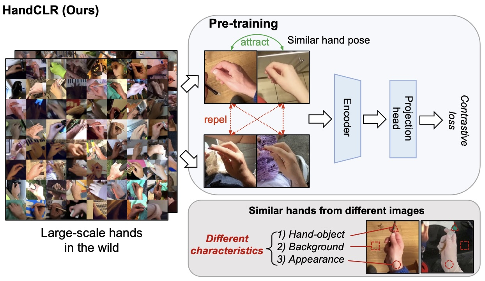

I'm a PhD student at the University of Tokyo, supervised by Prof. [Yoichi Sato](https://sites.google.com/ut-vision.org/ysato/). I focus on computer vision and human activity understanding, specifically involving video and multi-view understanding, vision-language multimodal models, and human body perception.

## 🎓 Education
* Ph.D. in Information Science @ The University of Tokyo (2026.3 expected)
* M.Sc. in Information Science @ The University of Tokyo (2023.3)
* B.Sc. in Computer Science @ Nanjing University (2020.7)

## 🔬 Research Experience
* Intern at CyberAgent AI Lab, Activity Understanding Team, 2024
* Intern at Shanghai AI Laboratory, OpenGVLab, 2023
* Intern at Microsoft Research Asia, Media Computing Group, 2022
* Intern at PCL Shenzhen, Virtual Reality Lab, 2021

## 🎖️ Services and Awards
* JSPS Research Fellowship for Young Scientists DC2
* Reviewer of CVPR, ICCV, ECCV, NeurIPS, ICML, ICLR, AAAI, ACMMM, BMVC
* UTokyo-IIS Research Collaboration Initiative Award
* “Stars of Tomorrow” award by Microsoft Research Asia
* Contracted photographer of Visual China Group

## 📄 Publications

    

        
    

    

        <h3>An Egocentric Vision-Language Model based Portable Real-time Smart Assistant</h3>
        
Yifei Huang, Jilan Xu, Baoqi Pei, Yuping He, Guo Chen, <b>Mingfang Zhang</b>, Lijin Yang, ..., Limin Wang   Arxiv preprint, 2025   <a href="https://arxiv.org/pdf/2503.04250">Paper</a> and <a href="https://github.com/OpenGVLab/vinci">Code</a>

    

---

    

        
    

    

        <h3>Egocentric Action-aware Inertial Localization in Point Clouds</h3>
        
<b>Mingfang Zhang</b>, Ryo Yonetani, Yifei Huang, Liangyang Ouyang, Ruicong Liu, Yoichi Sato   Arxiv preprint, 2025   <a href="https://arxiv.org/abs/2505.14346">Paper</a> and <a href="https://github.com/mf-zhang/Ego-Inertial-Localization">Demo and Code</a>

    

---

    

        
    

    

        <h3>SiMHand: Mining Similar Hands for Large-Scale 3D Hand Pose Pre-training</h3>
        
Nie Lin, Takehiko Ohkawa, Yifei Huang, <b>Mingfang Zhang</b>, Minjie Cai, Ming Li, Ryosuke Furuta, Yoichi Sato   International Conference on Learning Representations (ICLR), 2025   <a href="https://arxiv.org/pdf/2502.15251">Paper</a> and <a href="https://github.com/ut-vision/SiMHand">Code</a>

    

---

    

        
    

    

        <h3>Masked Video and Body-worn IMU Autoencoder for Egocentric Action Recognition</h3>
        
<b>Mingfang Zhang</b>, Yifei Huang, Ruicong Liu, Yoichi Sato   European Conference on Computer Vision (ECCV), 2024   <a href="http://www.arxiv.org/pdf/2407.06628">Paper</a> and <a href="https://github.com/mf-zhang/IMU-Video-MAE">Code</a>

    

---

    

        
    

    

        <h3>EgoExoLearn: A Dataset for Bridging Asynchronous Ego- and Exo-centric View of Procedural Activities in Real World</h3>
        
(* co-first author) Yifei Huang* , Guo Chen*, Jilan Xu*, <b>Mingfang Zhang</b>*, Lijin Yang, Baoqi Pei, Hongjie Zhang, Lu Dong, Yali Wang, Limin Wang, Yu Qiao   IEEE Conference on Computer Vision and Pattern Recognition (CVPR), 2024   <a href="https://arxiv.org/pdf/2403.16182.pdf">Paper</a> and <a href="https://github.com/OpenGVLab/EgoExoLearn">Code</a>

    

---

    

        
    

    

        <h3>Single-to-Dual-View Adaptation for Egocentric 3D Hand Pose Estimation</h3>
        
Ruicong Liu, Takehiko Ohkawa, <b>Mingfang Zhang</b>, Yoichi Sato   IEEE Conference on Computer Vision and Pattern Recognition (CVPR), 2024   <a href="https://arxiv.org/pdf/2403.04381.pdf">Paper</a> and <a href="https://github.com/ut-vision/S2DHand">Code</a>

    

---

    

        
    

    

        <h3>Structural Multiplane Image: Bridging Neural View Synthesis and 3D Reconstruction</h3>
        
<b>Mingfang Zhang</b>, Jinglu Wang, Xiao Li, Yifei Huang, Yoichi Sato, Yan Lu   IEEE Conference on Computer Vision and Pattern Recognition (CVPR), 2023   <a href="https://arxiv.org/pdf/2303.05937.pdf">Paper</a> and <a href="https://github.com/mf-zhang/Structural-MPI">Code</a>

    

---

    

        
    

    

        <h3>GazeOnce: Real-Time Multi-Person Gaze Estimation</h3>
        
<b>Mingfang Zhang</b>, Yunfei Liu, Feng Lu   IEEE Conference on Computer Vision and Pattern Recognition (CVPR), 2022   <a href="https://arxiv.org/abs/2204.09480">Paper</a> and <a href="https://github.com/mf-zhang/GazeOnce">Code</a>

    

---

    

        
    

    

        <h3>Optical Flow in the Dark</h3>
        
<b>Mingfang Zhang</b>, Yinqiang Zheng, Feng Lu   IEEE Transactions on Pattern Analysis and Machine Intelligence (TPAMI), 2021   <a href="https://ieeexplore.ieee.org/document/9626625">Paper</a> and <a href="https://github.com/mf-zhang/Optical-Flow-in-the-Dark">Code</a>

    

---

    

        
    

    

        <h3>Optical Flow in the Dark</h3>
        
(*co-first author) Yinqiang Zheng*, <b>Mingfang Zhang</b>*, Feng Lu   
        IEEE Conference on Computer Vision and Pattern Recognition (CVPR), 2020     <a href="http://openaccess.thecvf.com/content_CVPR_2020/papers/Zheng_Optical_Flow_in_the_Dark_CVPR_2020_paper.pdf">Paper</a> and <a href="https://github.com/mf-zhang/Optical-Flow-in-the-Dark">Code</a>

    

<!-- Google tag (gtag.js) -->

