My research focus on computer vision and human activity understanding, specifically involving:  
[a] video and multi-view understanding;  
[b] vision-language multimodal models;  
[c] human body perception.  


  
You can also find my articles on <a href="{{site.author.googlescholar}}">my Google Scholar profile</a>.



    
Arxiv

    

        #[b3]
    

    

        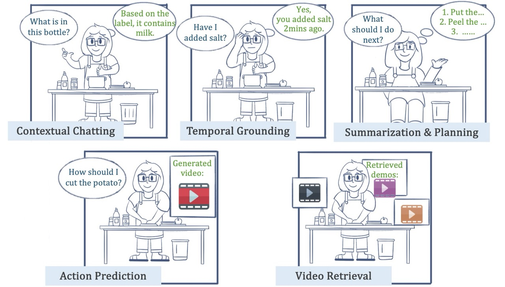
    

    

        <h3 class="publication-title">An Egocentric Vision-Language Model based Portable Real-time Smart Assistant</h3>
        
Yifei Huang, Jilan Xu, Baoqi Pei, Yuping He, Guo Chen, <b>Mingfang Zhang</b>, Lijin Yang, ..., Limin Wang

        
Arxiv preprint, 2025

        

            <a href="/publication/2025-03-01-egocentric-vision-language-model">Project Page</a>
        

    

    
Arxiv

    

        #[b2]
    

    

        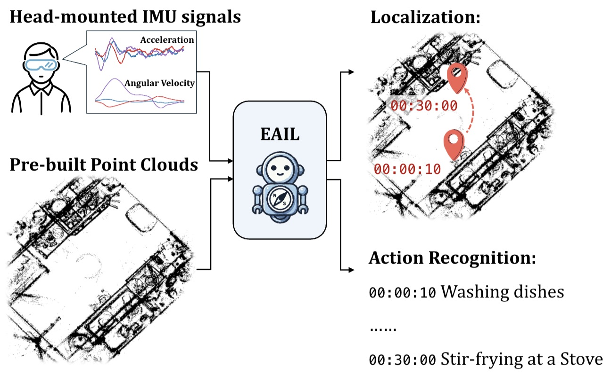
    

    

        <h3 class="publication-title">Egocentric Action-aware Inertial Localization in Point Clouds</h3>
        
<b>Mingfang Zhang</b>, Ryo Yonetani, Yifei Huang, Liangyang Ouyang, Ruicong Liu, Yoichi Sato

        
Arxiv preprint, 2025

        

            <a href="/publication/2025-05-01-egocentric-action-aware-inertial-localization">Project Page</a>
        

    

    
TCSVT

    

        #[b1]
    

    

        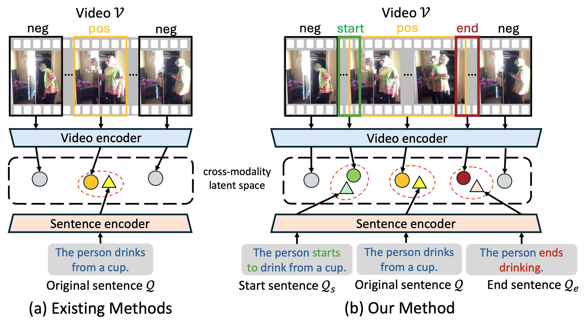
    

    

        <h3 class="publication-title">Prompt-augmented Boundary Attentive Learning for Weakly Supervised Temporal Sentence Grounding</h3>
        
Zhehao Zhu, Yifei Huang, <b>Mingfang Zhang</b>, Liangyang Ouyang, Yoichi Sato

        
IEEE Transactions on Circuits and Systems for Video Technology (TCSVT), 2025

        

            <a href="/publication/2025-01-01-prompt-augmented-boundary-attentive-learning">Project Page</a>
        

    

    
ICLR

    

        #[c3]
    

    

        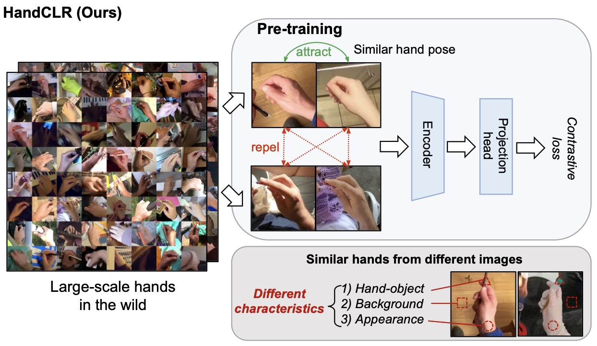
    

    

        <h3 class="publication-title">SiMHand: Mining Similar Hands for Large-Scale 3D Hand Pose Pre-training</h3>
        
Nie Lin, Takehiko Ohkawa, Yifei Huang, <b>Mingfang Zhang</b>, Minjie Cai, Ming Li, Ryosuke Furuta, Yoichi Sato

        
International Conference on Learning Representations (ICLR), 2025

        

            <a href="/publication/2025-02-01-simhand">Project Page</a>
        

    

    
ECCV

    

        #[a5]
    

    

        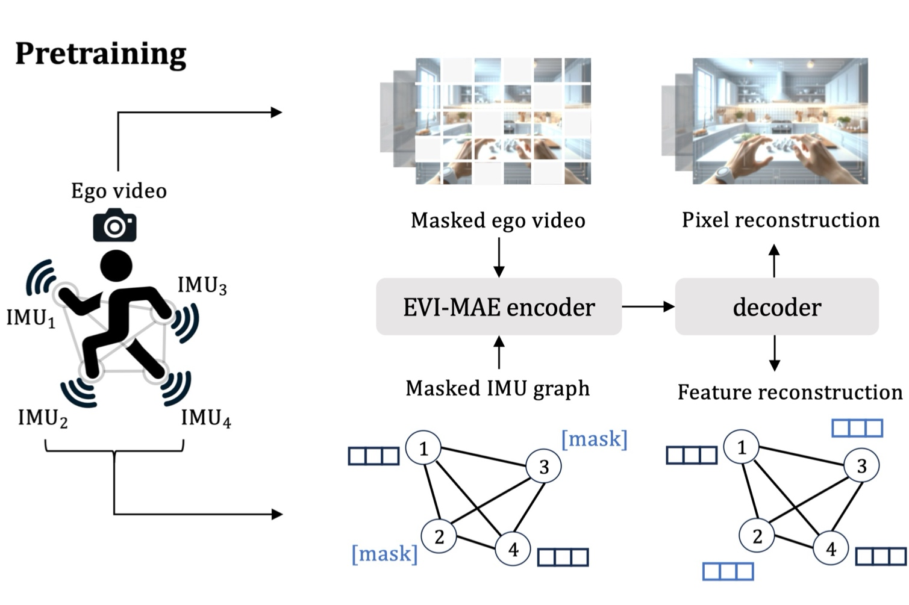
    

    

        <h3 class="publication-title">Masked Video and Body-worn IMU Autoencoder for Egocentric Action Recognition</h3>
        
<b>Mingfang Zhang</b>, Yifei Huang, Ruicong Liu, Yoichi Sato

        
European Conference on Computer Vision (ECCV), 2024

        

            <a href="/publication/2024-07-01-masked-video-imu-autoencoder">Project Page</a>
        

    

    
CVPR

    

        #[a4]
    

    

        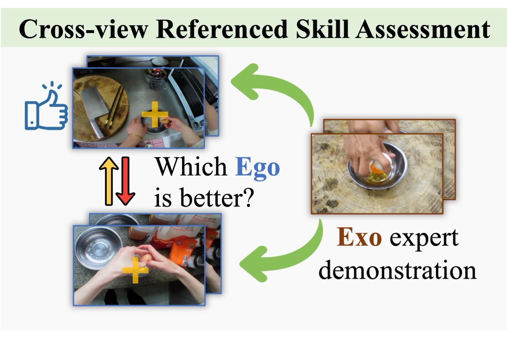
    

    

        <h3 class="publication-title">EgoExoLearn: A Dataset for Bridging Asynchronous Ego- and Exo-centric View of Procedural Activities in Real World</h3>
        
(* co-first author) Yifei Huang* , Guo Chen*, Jilan Xu*, <b>Mingfang Zhang</b>*, Lijin Yang, Baoqi Pei, Hongjie Zhang, Lu Dong, Yali Wang, Limin Wang, Yu Qiao

        
IEEE Conference on Computer Vision and Pattern Recognition (CVPR), 2024

        

            <a href="/publication/2024-03-01-egoexolearn">Project Page</a>
        

    

    
CVPR

    

        #[c2]
    

    

        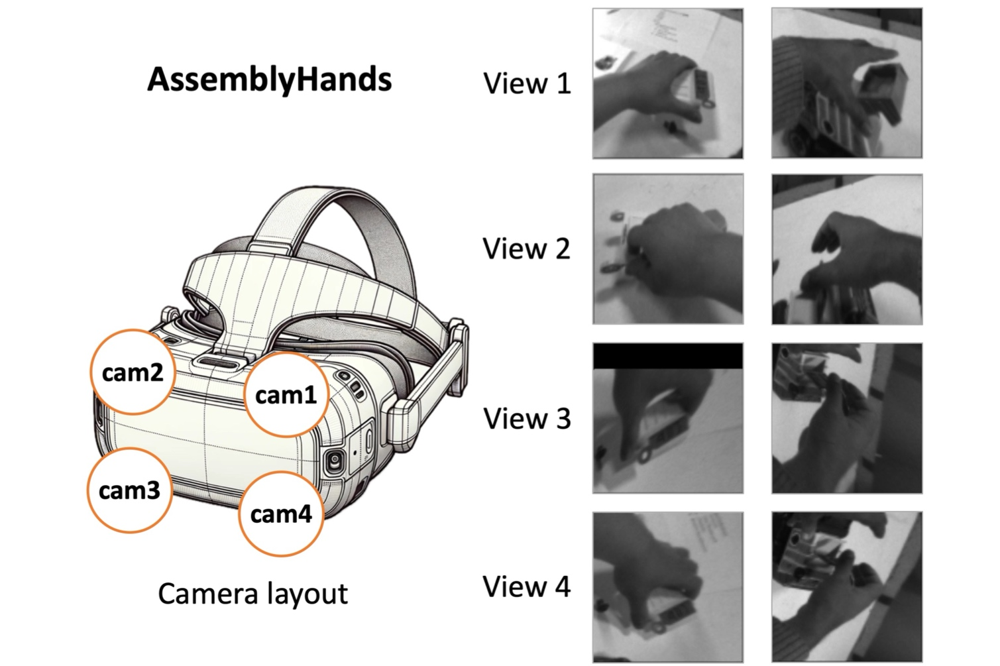
    

    

        <h3 class="publication-title">Single-to-Dual-View Adaptation for Egocentric 3D Hand Pose Estimation</h3>
        
Ruicong Liu, Takehiko Ohkawa, <b>Mingfang Zhang</b>, Yoichi Sato

        
IEEE Conference on Computer Vision and Pattern Recognition (CVPR), 2024

        

            <a href="/publication/2024-03-01-s2dhand">Project Page</a>
        

    

    
CVPR

    

        #[a3]
    

    

        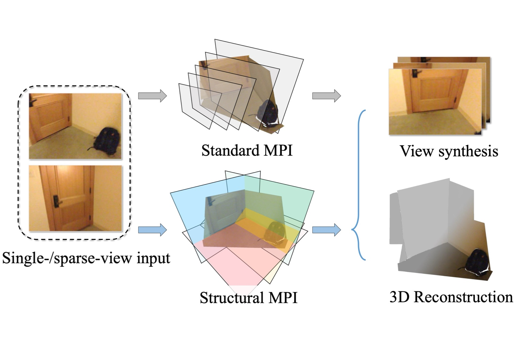
    

    

        <h3 class="publication-title">Structural Multiplane Image: Bridging Neural View Synthesis and 3D Reconstruction</h3>
        
<b>Mingfang Zhang</b>, Jinglu Wang, Xiao Li, Yifei Huang, Yoichi Sato, Yan Lu

        
IEEE Conference on Computer Vision and Pattern Recognition (CVPR), 2023

        

            <a href="/publication/2023-03-01-structural-mpi">Project Page</a>
        

    

    
CVPR

    

        #[c1]
    

    

        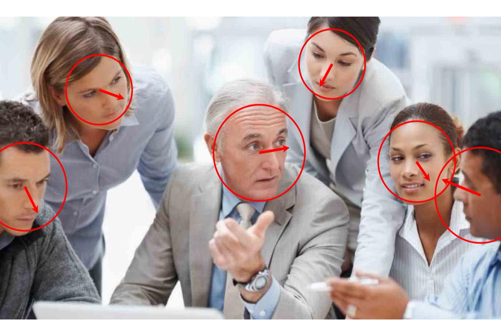
    

    

        <h3 class="publication-title">GazeOnce: Real-Time Multi-Person Gaze Estimation</h3>
        
<b>Mingfang Zhang</b>, Yunfei Liu, Feng Lu

        
IEEE Conference on Computer Vision and Pattern Recognition (CVPR), 2022

        

            <a href="/publication/2022-04-01-gazeonce">Project Page</a>
        

    

    
TPAMI

    

        #[a2]
    

    

        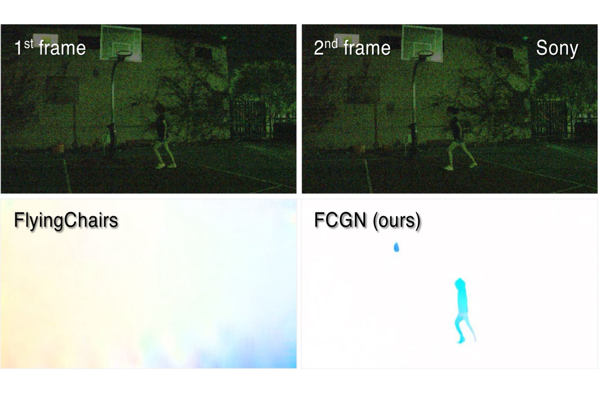
    

    

        <h3 class="publication-title">Optical Flow in the Dark</h3>
        
<b>Mingfang Zhang</b>, Yinqiang Zheng, Feng Lu

        
IEEE Transactions on Pattern Analysis and Machine Intelligence (TPAMI), 2021

        

            <a href="/publication/2021-12-01-optical-flow-dark">Project Page</a>
        

    

    
CVPR

    

        #[a1]
    

    

        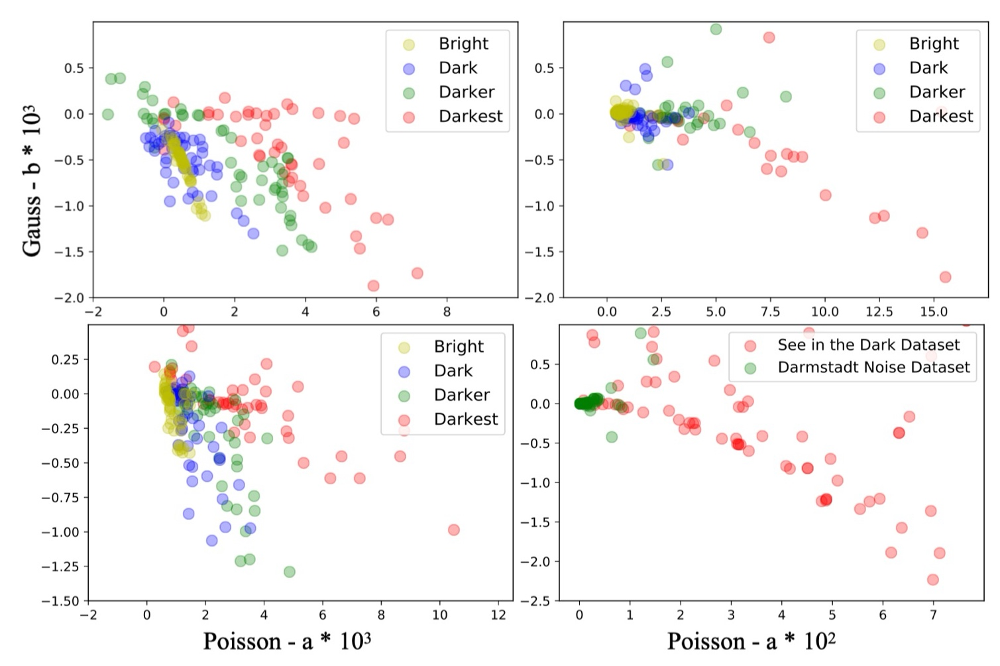
    

    

        <h3 class="publication-title">Optical Flow in the Dark</h3>
        
(*co-first author) Yinqiang Zheng*, <b>Mingfang Zhang</b>*, Feng Lu

        
IEEE Conference on Computer Vision and Pattern Recognition (CVPR), 2020

        

            <a href="/publication/2020-04-01-optical-flow-dark">Project Page</a>
        

    

